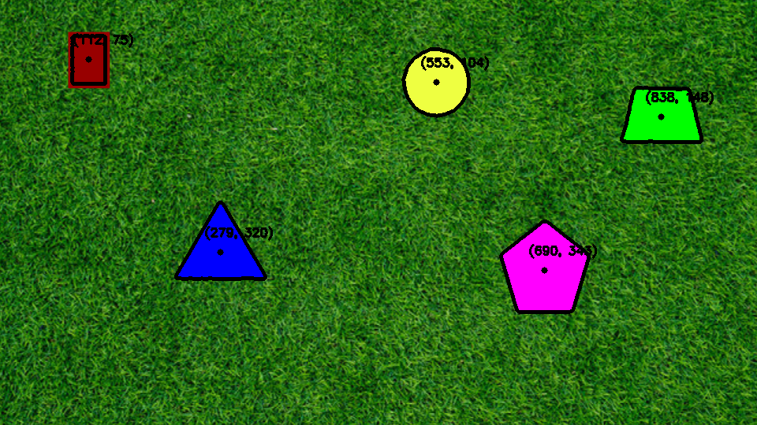

# Penn Aerial Robotics Application
Dependencies
1. [python3](https://python.org)
1. opencv-python\
`pip3 install opencv-python`
2. numpy\
`pip3 install numpy`
3. matplotlib\
`pip3 install matplotlib`

Clone Repository using
`git clone https://github.com/kevins4202/AiR-challenge.git`

1. Static image processing\
`python3 p1.py`\
Output: p1_output.png\
For the first challenge, I tried multiple approaches constituting a combination of blurring, eroding, dilating,
 masking, canny image detection, and contouring. I knew that I had to use contouring to detect the area of the
shapes, but I found that canny edge detection was better for detecting the shapes. So, my final solution was to
first blur the image three times to smooth the image initially, then masking the grass (manually selecting the upper
and lower bounds). I then used canny edge detection to find the edges, and contouring to refine them and make them
better defined. I then calculated the centers of the shapes using center of mass.\
I know this algorithm was extremely inefficient because I used many algorithms that had to go over the whole image
such as masking, and it took a long time to refine the algorithm to get it to work with the video.

3. Video 1\
`python3 p2.py`\
\
Output: p2_output.mp4 (click on the black image)\
When I pasted the algorithm in for the video the first time, I saw that it was extremely slow and did not work since the images were moving around. So, I basically had to change the whole algorithm and discover a more efficient way to process
the images. I found that instead of processing the colors, I could instead use the uniformity of the shapes to process the images. THis meant no masking, which increased the efficiency of the algorithm, and instead focusing on the contrast instead. Following this principle, I first immediately converted the image to grayscale and increased the contrast to the maximum. I then ran the canny edge detection and dilated the edges four times to make the shapes more apparent and blot out the bad lines like before. This worked because in the background, there are many small edges, and when you expand them they overlap each other to make almost a uniform background, with the shapes untouched. This cleaned up the image almost immediately, and I could go directly to contouring and calculating the centers of the shapes like before. This algorithm was much faster and simpler than before, and it took me a long time to realize that the colors weren't that much necessary.

5. Video 2\
`python3 p3.py`\
\
Output: p3_output.mp4 (click on the black image)\
The third challenge was much easier since it was just the first video with more color contrast. However, my algorithm didn't use color contrast so I could use the exact same algorithm as before. I know this algorithm is still much slower than the video, abnd I think that in real life I could read every other frame to make it faster. I think the main things that are slowing the algorithm down are the canny edge detection and the contrast increase. The former is slow because there are many inconsistencies in the background so there are many edges to draw, and the latter because you have to go through the entire image and change each pixel while considering others around it. However, I am satisfied with the fact that I am able to filter out so many of the background noise and have the algorithm consistently calculate the centers of the shapes.
